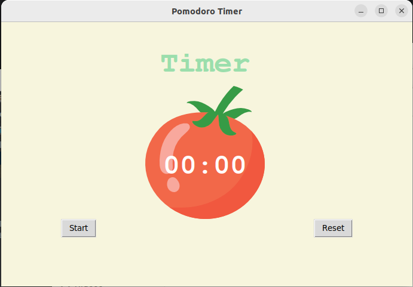
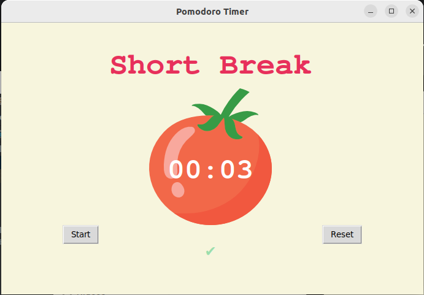
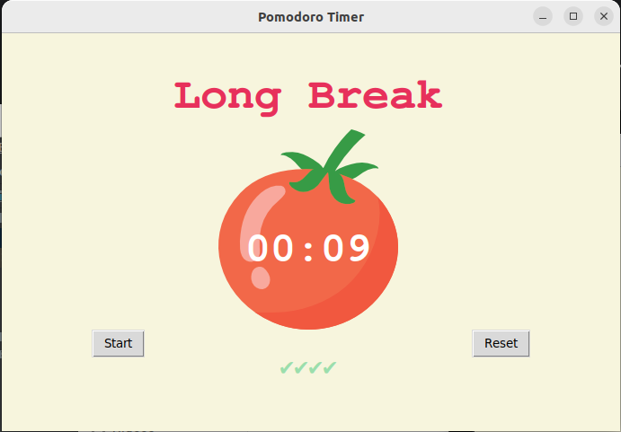

# Pomodoro Timer

## Features
- Created in Python with the 'tkinter' package.
- Has four 'work' phases, 25 minutes each.
- Has three 'short breaks', 5 minutes each, after the first three 'work' phases.
- Has one 'long' break, 20 minutes, after the fourth 'work' phase.

##

Refer to the images below to see the Pomodoro Timer program:

 

 

 

 